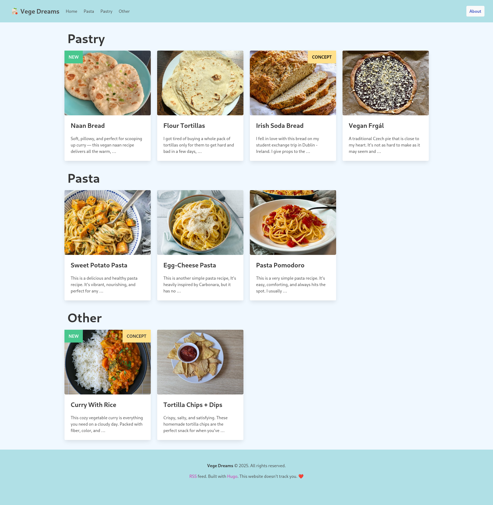

# vege-dreams
This is my cooking website. It is built with Hugo Bulma.io and Sass.



## How to run locally

### Install hugo
#### On Arch:
```
sudo pacman -S hugo
```
or for git build from AUR
```
paru -S hugo-git
```

### Run as a local server
``` bash
hugo server -D
```

## To-do
- Add more recipes of course
- Be able to live without meat 😚
