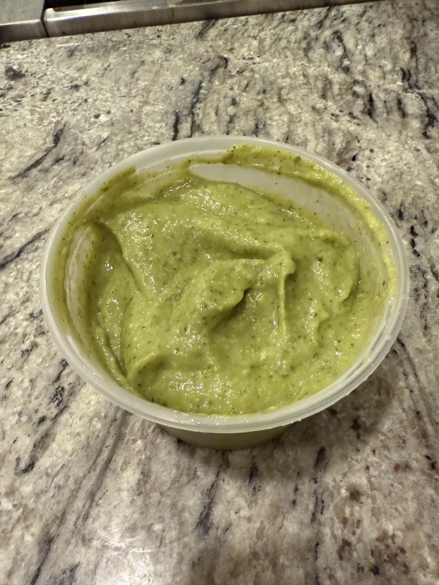
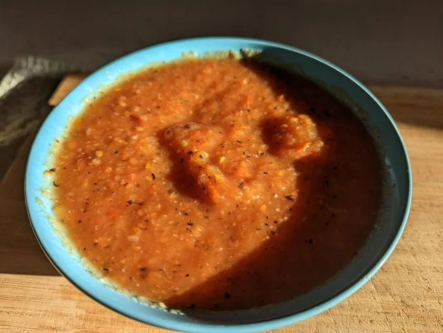
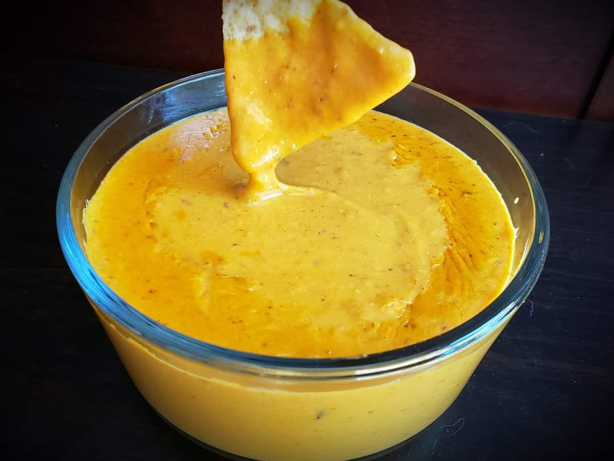

If you got a dried out tortilla because your partner (or mom) forgot to close the bag, then you can just make these chips out of them to save them from having to throw them out.

Prep time: 10 minutes

Cooking time: 15 minutes

### Ingredients
- [ ] 6–8 corn or flour tortillas
- [ ] 2 tbsp olive oil or melted butter
- [ ] ½ tsp salt
- [ ] Optional: paprika, chili powder, cumin, or garlic powder

### Steps
1. **Preheat oven** to 180 °C.

2. **Cut** tortillas into triangles. Brush both sides with olive oil or butter.

3. **Season and Bake:** Sprinkle with salt and any optional spices. Spread on a baking sheet in a single layer. Bake for 10–15 minutes, flipping halfway, until crisp and golden.

4. **Let cool** slightly before serving. Chips will crisp up more as they cool.

---

Dips
---

### Avocado-Lime Dip

#### Ingredients
- [ ] 1 avocado
- [ ] 3 tbsp plain yogurt or sour cream
- [ ] Some lime juice
- [ ] 1 small garlic clove, minced
- [ ] Salt and pepper to taste
- [ ] Optional: chili flakes

#### Steps
1. Mash avocado in a bowl or blend for smoothness.  
2. Stir in yogurt, lime juice and add garlic.  
3. Season to taste. Optionally mix in chili flakes.

### Roasted Tomato Salsa

#### Ingredients
- [ ] 3 medium tomatoes, chopped into a sauce basically
- [ ] ½ small red onion, very finely chopped
- [ ] 1 garlic clove, minced
- [ ] 1 tbsp olive oil
- [ ] Some lime juice
- [ ] Salt + pepper
- [ ] Optional: 1 chili pepper

#### Steps
1. Literally just combine everything and spice depending to your taste

### Cheese Dip (Queso)

#### Ingredients
- [ ] 1 tbsp butter
- [ ] 1 tbsp flour
- [ ] 1 cup milk
- [ ] 1½ cups shredded cheddar cheese
- [ ] A pinch of garlic powder
- [ ] Salt to taste
- [ ] Optional: chopped jalapeños or diced tomato

#### Steps
1. Melt butter in saucepan, whisk in flour, and cook for 1 minute.  
2. Slowly add milk, whisking constantly.  
3. Add shredded cheese and stir until melted and smooth.  
4. Season with garlic powder and salt. Mix in optional jalapeños or tomato. Serve warm.

