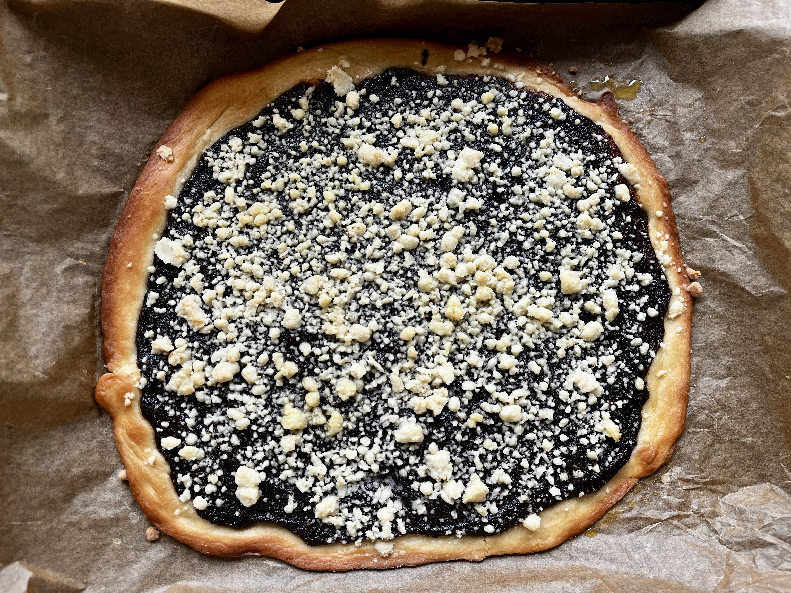
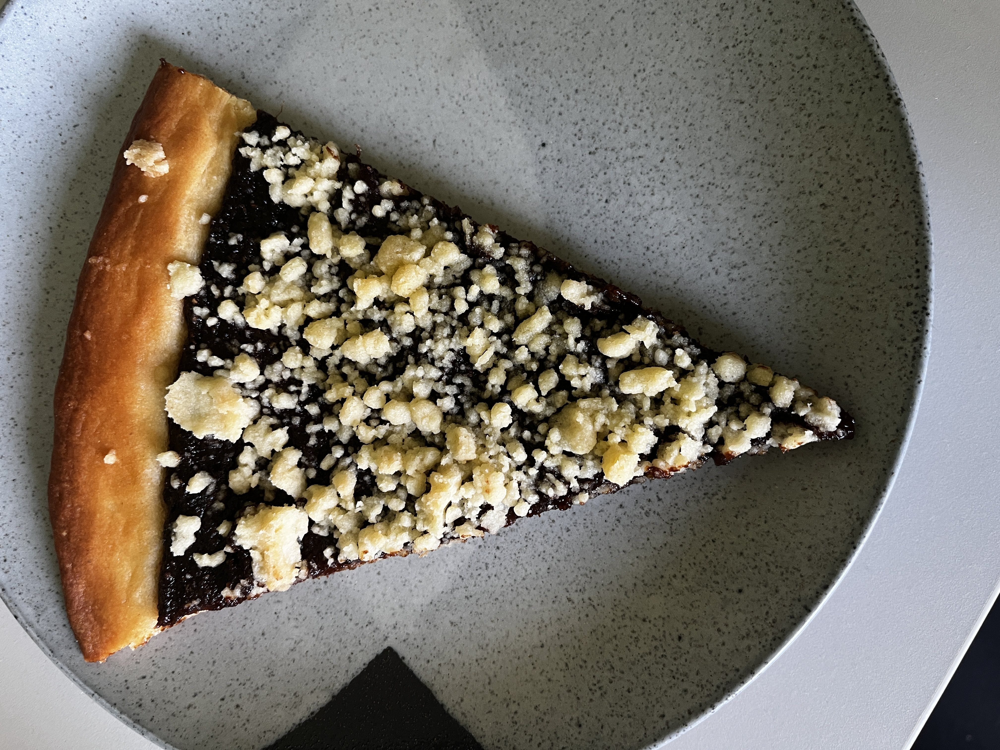

A traditional Czech pie that is close to my heart. It's not as hard to make as it may seem and it's quite a fun recipe. Sooo simple to make vegan too!

There is a variety of different fillings you can use, in this recipe I will show you how to make a plum jam version and a pear version. However, there is a hoast of other possible options and you can find them readily online. 

<i>Tip: The dough can be quite sticky, so make sure to flour your hands and the surface you are working on.</i>

<i>Tip: Homemade jams vary in thickness and sweetness, adjust accordingly.</i>

Prep time: 30 minutes

Cooking time: 30 minutes

### Ingredients for 1 frgál
#### Dough
- [ ] 130g flour
- [ ] 20g icing sugar
- [ ] 1 packet (7g) of instant yeast
- [ ] 1/2 tsp salt
- [ ] 60g soy milk 
- [ ] 35g vegan butter
- [ ] 1/2 tsp lemon zest

#### Crumb topping (~'drobenka')
- [ ] 40g vegan butter
- [ ] 40g icing sugar
- [ ] 75g flour

### Steps
1. Add the yeast to all the milk (warm, but not hot) and let it sit for 5 minutes.
2. Mix all the dry ingredients for the dough in a bowl.
3. Add the milk with the yeast and the melted butter to the dry ingredients.
4. Mix and then knead the dough until it's smooth and let it rest for 30 minutes.
5. Preheat the oven to 180°C.
6. Roll out the dough to a circle on a flour-dusted surface.
7. Spead the filling evenly on the dough.
8. Mix all the ingredients for the crumb topping and sprinkle it on top of the filling.
9. Bake for 30 minutes.
10. Let it cool down before cutting it into slices.

<h3 class="title">Plum jam filling (1 frgál)</h3>
Prep time: 5 minutes

- [ ] 350g plum jam
- [ ] 1 packet vanilla sugar
- [ ] ~15g breadcrumbs
- [ ] optionally a splash or rum

Mix the jam with the vanilla sugar and rum. The filling should be only slightly runny and should spread without moving. If it's too runny, add breadcrumbs until it thickens.

<h3 class="title">Pear jam filling (1 frgál)</h3>
Prep time: 5 minutes

- [ ] 350g plum jam
- [ ] 1 packet vanilla sugar
- [ ] ~15g breadcrumbs
- [ ] optionally a splash or rum
- [ ] 1 tablespoon cinnamon
- [ ] 1 tablespoon ground star anise

Mix the jam with the vanilla sugar and rum. The filling should be only slightly runny and should spread without moving. If it's too runny, add breadcrumbs until it thickens.

Here are some more pictures 😉

Plum jam version

A single slice

