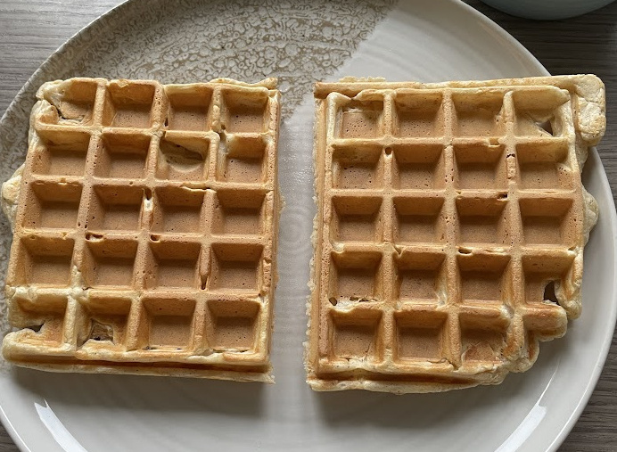

This is a fairly light dinner (or breakfast) waffle recipe that's about 300 calories and doesnt have added sugar in it ;-). Also this is in tablespoons coz no way I'm taking out a scale for waffles lol. You can also use the same recipe to make it into pancakes, the world's your oyster ig.

Prep time: 3 minutes

Cooking time: 5 minutes

### Ingredients for 2 normal square waffles or one big round waffle
- [ ] 1 egg
- [ ] 2 tbsp flour (plain or oat)
- [ ] 2 tbsp plain white yogurt (batter)
- [ ] ½ tsp baking powder
- [ ] Sprinkle of cinnamon
- [ ] ½ cup frozen berries
- [ ] 2 tbsp Greek yogurt or quark (for topping)

### Steps
1. **Make the batter:**  
   In a bowl, mix the egg, flour, 2 tbsp of yogurt, baking powder, and cinnamon. Let it sit for like 3 minutes to let it rise for a bit.

2. **Heat your waffle maker:**  
   Preheat your waffle maker while the batter rests.

3. **Cook:**  
   Pour the batter in and cook until the waffle is golden and fluffy. Don't open the waffle maker too soon to check coz u will separate the batter and mess up the waffle, BE PATIENT! Also it takes like 5 minutes, depends on your waffle maker tho ig.

4. **Warm the berries:**  
   Microwave the frozen berries in short (like 20sec) spurts and mix them inbetween.

5. **Assemble:**  
   Spread the white yogurt on the waffle and sprinkle the unfrozen berries on the top. That's it, go on and enjoy it <3

### Also i HAD to share these pics 🥰🥰🥰

These just look too perfect

This is peanut butter with banana slices, SO GOOD!!!

