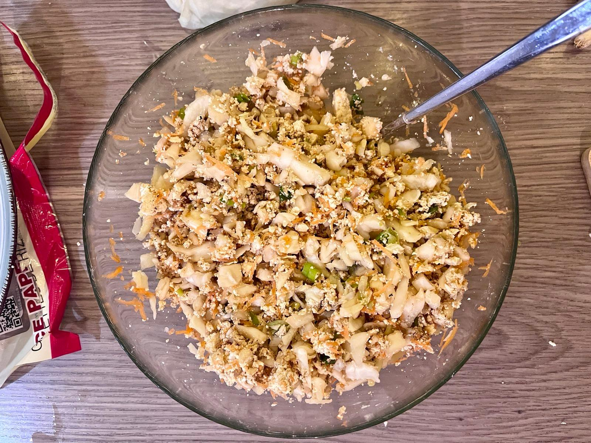

This recipe is brought to you by: The long shelf life of rice paper; Made by finally using up my old pack of partially shattered rice paper. Tasty rice paper dumplings, filled with a simple tofu & cabbage filling.

Now, I have picked up on the frowns of any Asian foodie, rice paper dumplings are somewhat of a sacrilege. But they taste nice and I think that's all that counts :)

Here is the shot of the filling, make sure to not overfill the dumplings, or they will break. Also, you want to chop the cabbage as finely as you can. These cook very quickly and you don't want raw cabbage!

## How to wrap
Here's a quick video on how to wrap these. You don't have to double wrap, but the risk of breakage is a lot higher. But I'm sure you won't be able to tell which of the 4 dumplings in the final photo are double wrapped.

<video width=100% controls loop muted playsinline class="video not-full-width">
    <source src="/videos/52CC3982-2200-4E6B-8349-FDE022245C15.webm" type="video/webm">
    Your browser does not support the video tag.
</video>

Prep time: 20 minutes

Cooking time: 15 minutes

### Ingredients for 8 dumplings
- [ ] 1/4 cabbage (~250g)
- [ ] 1 medium carrot
- [ ] 1 block of tofu (200g)
- [ ] 3 cloves of garlic, minced
- [ ] about the same in ginger, minced
- [ ] 1 tbsp soy sauce
- [ ] 1 tbsp sesame oil
- [ ] salt and pepper to taste

### Steps
1. Chop the cabbage as finely as you can. Grate the carrot.
2. Add the cabbage and carrot to a mixing bowl.
3. Crumble in your tofu and add the garlic, ginger, soy sauce, sesame oil, salt and pepper.
4. Mix until combined.
5. Take a rice paper sheet and dip it in water until it's soft.
6. Add about 3 tbsp of filling to the center of the rice paper.
7. Fold the rice paper over the filling and roll it up.
8. Repeat until you run out of filling. The measurements above should make about 8 very well filled dumplings.
9. Heat up a pan with a bit of oil and fry the dumplings on both sides until golden brown.
10. Ideally serve with a dipping sauce, I tend not to bother :)

