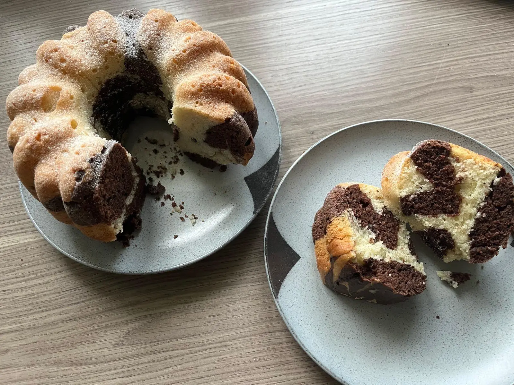
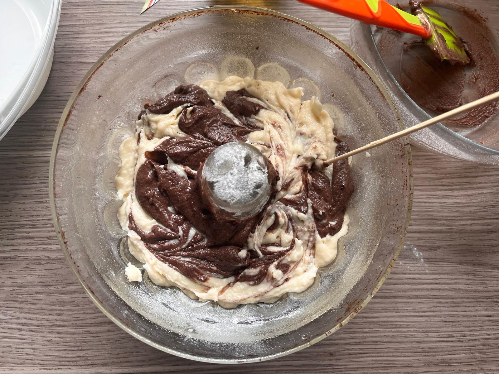

In my inevitable descent into becoming a housewife I have turned to the humble marble bundt cake. It's a fairy typical dessert to eat in the Czech Republic and I haven't had it in years. Hence, I present a recipe for this delicious staple of the mundane Sunday family occasion. Loosely inspired by [this recipe](https://web.archive.org/web/20230401104615/https://plantifulbakery.com/cs/vegan-mramorova-babovka/).

Final result - Marble effect

Prep time: 15 minutes

Cooking time: 45 minutes

### Ingredients for 1 bundt cake
- [ ] 320g all purpose flour
- [ ] 150g white sugar (yeah it's a lot)
- [ ] 200g vegan yoghurt
- [ ] 100ml plant-based milk
- [ ] 2 tablespoons baking powder
- [ ] 1 tablespoon baking soda
- [ ] 120g neutral oil
- [ ] juice of 1/2 lemon / vinegar
- [ ] 15g cocoa powder
#### Optionally add
- [ ] confectioners' sugar to decorate

### Steps
1. Preheat the oven to 180°C
2. Mix the dry ingredients in a bowl (flour, sugar, baking powder, baking soda)
3. Add the wet ingredients (yoghurt, milk, oil, lemon juice) to a separate bowl and mix
4. Sift the dry ingredients into the wet ingredients and mix until combined
5. Pour about half of the batter into a separate bowl and mix in the cocoa powder
6. Grease a bundt cake form with oil, add some flour to coat the oil and pour in the batter alternating between the white and the chocolate batter in random patterns
7. Take a skewer and swirl it through the batter to create a marble effect
8. Bake for 45 minutes or until a skewer inserted into the cake comes out clean (I would start to watch it after ~35 minutes)

